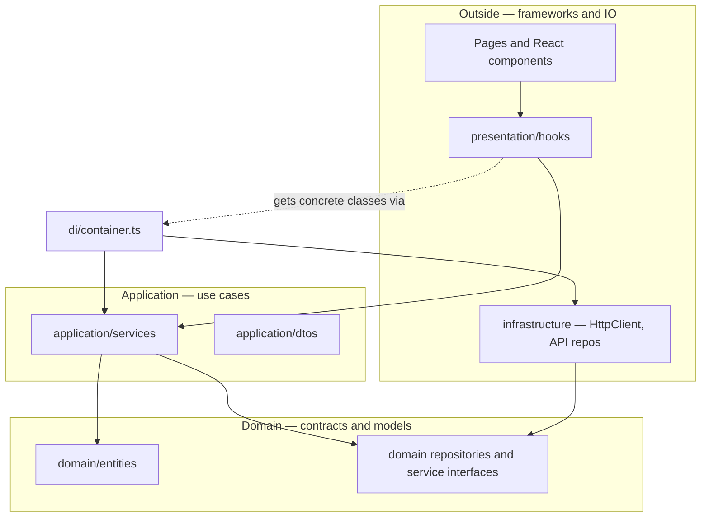

# Frontend architecture (for juniors)

This document explains **how this admin dashboard frontend is organized** and **where to put new code**. You do not need to know every pattern in the world—just follow the flow below.

## Why not put everything in one folder?

If screens call `fetch` or `axios` directly, and business rules live inside random components, the app becomes hard to test and hard to change (for example when the API shape changes).

Here we split responsibilities into **layers**. Each layer has one job. **Inner layers do not depend on outer layers**—only the other way around.

## The big picture

Think of an onion: the **center** is your business concepts; the **outside** talks to React, HTTP, cookies, and third-party services.

**In one sentence:** UI talks to **hooks**; hooks talk to **application services**; services talk to **repository interfaces**; **infrastructure** classes implement those interfaces and actually call the API.

## The four layers (what each one does)

| Layer | Folder | Purpose | Rule of thumb |
|--------|--------|---------|----------------|
| **Domain** | `src/core/domain` | Entities (e.g. `User`, `Customer`) and **interfaces** (`IUserRepository`, `ICustomerService`). | No React, no HTTP, no `import axios`. |
| **Application** | `src/core/application` | **DTOs** (shapes for API/input) and **service classes** that implement domain service interfaces and orchestrate work. | Calls repository **interfaces**, not concrete API classes. |
| **Infrastructure** | `src/core/infrastructure` | **HttpClient**, **Api*Repository** classes, DI **container**, token helpers. | Knows URLs, headers, cookies, Axios. |
| **Presentation** | `src/core/presentation` | **React hooks** (`useAuth`, `useUserManagement`, `useCustomerManagement`, …) that hold UI-related state and call services. | Components import hooks, not repositories. |

**Supporting code (not “layers” but shared):**

- `src/lib/` — cookies, i18n, small utilities used by infrastructure or hooks.
- `src/features/permissions/` — route/sidebar permission skeleton (adapt per product).
- `src/app/`, `src/pages/`, `src/widgets/`, `src/shared/` — app shell, routes, screens, reusable UI. These sit **outside** `core` and should stay thin.

## Dependency direction (the rule you must not break)

- **Allowed:** `presentation` → `application` → `domain`  
- **Allowed:** `infrastructure` implements interfaces **defined in** `domain`  
- **Not allowed:** `domain` importing from `application`, `infrastructure`, or `presentation`

If you are tempted to import `HttpClient` inside a page or inside `domain`, stop—that belongs in `infrastructure`.

## End-to-end example: login

1. User submits a form in a **page/component** (under `src/pages` or similar).
2. Component calls **`useAuth()`** from `src/core/presentation/hooks/useAuth.tsx`.
3. The hook uses **`container.resolve('authService')`** to get the real **`AuthService`** (`src/core/application/services/AuthService.ts`).
4. **`AuthService`** calls **`ApiAuthRepository`** (infrastructure) through the constructor wiring in the container.
5. **`ApiAuthRepository`** uses **`HttpClient`** to POST to the auth endpoint and stores tokens via **`src/lib/cookies.ts`**.

The page never sees the URL or Axios details—only `login(email, password)`.

## Dependency injection container

File: **`src/core/infrastructure/di/container.ts`**

- **What it is:** A small registry that creates “the real” objects once and hands them out (`register` / `resolve`).
- **Why:** Hooks and services do not `new ApiCustomerRepository()` everywhere; the container wires **interfaces** to **implementations** in one place.
- **When you add a feature:** Register new repositories and services here so hooks can `resolve` them by key.

## Configuration you will touch

- **`VITE_API_URL`** — base URL for the API (see `src/core/infrastructure/api/constants.ts`). Set it in `.env` for local development.
- **Endpoint paths** — update `API_ENDPOINTS` in `constants.ts` to match your backend contract.

## Template starter features

Customer Royalty App core flows:

1. **Auth** — client register/login/OTP via `useAuth` (`/api/v1/client/auth/*`)
2. **Points** — QR rotate + transactions via `useClientPoints` (`/api/v1/client/points/*`)
3. **Campaigns** — discover sales / discount preview / redeem via `useClientCampaigns`
4. **Users / Customers** — leftover architecture samples (`useUserManagement`, `useCustomerManagement`)

The product UI is member-facing (Home / Rewards / Profile), not an admin dashboard.

## How to add a new feature (checklist)

Work **from the inside out**:

1. **Domain:** Add or extend **entities** under `src/core/domain/entities` if you have a new business concept.
2. **Domain:** Add **repository interface** (`IThingRepository`) and/or **service interface** (`IThingService`) under `src/core/domain/repositories` or `.../services`.
3. **Application:** Add **DTOs** under `src/core/application/dtos` for request/response shapes.
4. **Application:** Implement **`ThingService`** under `src/core/application/services`, depending only on the repository **interface**.
5. **Infrastructure:** Implement **`ApiThingRepository`** using `HttpClient` and paths from `constants.ts`.
6. **Infrastructure:** **Register** both in `container.ts`.
7. **Presentation:** Add **`useThingManagement.tsx`** (or similar) that resolves the service and exposes state/actions to the UI.
8. **UI:** Build pages/components that use **only the hook** (and presentational props), not the repository.

## Tips that save time

- **DTO vs entity:** DTOs match API payloads; entities are the shape we prefer in the app after mapping. Some code maps between them in repositories or services—follow existing files in the same feature.
- **Reuse patterns:** Before inventing a new structure, mirror the Customers or Users feature end to end.
- **Lint and build:** Run `npm run lint` and `npm run build` before opening a PR.

## Where to read more in this repo

- **`src/core/README.md`** — quick map of `src/core` folders and hook examples.

If something in this doc does not match the code, prefer the code and then update this file—that keeps the team aligned.
